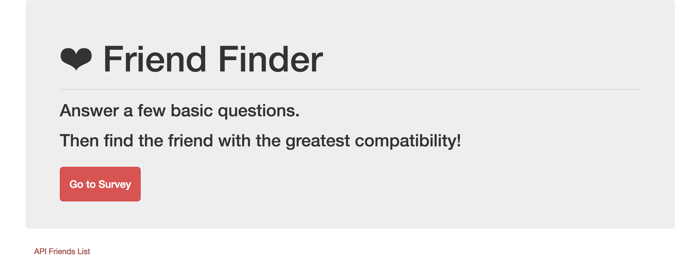

# FriendFinder

### Overview

In this activity, I built a compatibility-based "FriendFinder" application. This full-stack site will take in results from the users' surveys and then compare their answers with those from other users. The app will then display the name and picture of the user with the best overall match. 

I used Express.js to handle routing and deployed the app to Heroku so other users can fill out the survey at the website.

### Technologies

* Express.js
* jQuery
* Bootstrap CSS Framework
* RegEx
* JSON
* AJAX

### Deployed Link

https://fathomless-inlet-59641.herokuapp.com/

